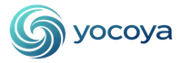

# Yocoya.ai — Media Kit

## About Yocoya

**Yocoya.ai** is the leading Spanish-language WhatsApp business tools directory and Kommo CRM partner hub for Mexico and Latin America. We help WhatsApp-dependent businesses discover, compare, and adopt the right tool stack — with Kommo as the recommended CRM hub.

Founded by **Baalam LLC**, Yocoya was built by Mexican creators and strategists who saw that most business automation content was in English and disconnected from the LATAM economy and culture. We changed that.

> *"No solo traducimos tecnología; la adaptamos a tu realidad."*
> — We don't just translate technology; we adapt it to your reality.

---

## What We Do

| Section | Description |
|---------|-------------|
| **Herramientas** (Tools) | Curated directory of WhatsApp business tools with pricing, use cases, and honest reviews |
| **Stacks** | Pre-built tool combinations radiating from Kommo CRM (Lead Gen, Sales Automation, Customer Service) |
| **Noticias** (News) | Daily AI and WhatsApp business news from 50+ sources, filtered for LATAM relevance |
| **Recursos** (Resources) | APIs, courses, certifications, and communities for learning automation |
| **Boletín FrecuenciA** | Weekly newsletter delivering curated insights to subscribers |

---

## Brand Assets

### Logo

| Variant | Preview |
|---------|---------|
| Full logo |  |
| Icon only |  |

Download all logo files from the [`/logos`](./logos/) directory.

### Usage Guidelines

- Maintain clear space around the logo (minimum 1x the height of the icon)
- Do not stretch, rotate, or alter the logo colors
- Logo has a transparent background — place on light or gradient backgrounds

### Brand Colors

| Color | Hex | Usage |
|-------|-----|-------|
| Teal (Primary) | `#0D8A9A` | Primary brand color, headings, key UI elements |
| Teal Light | `#1FB6C9` | Gradients, hover states, accent highlights |
| Warm Orange (CTA) | `#F97316` | Call-to-action buttons, affiliate links, emphasis |
| White | `#FFFFFF` | Primary text, card surfaces |
| Slate-50 | `#F8FAFC` | Page backgrounds, subtle fills |
| Slate-600 | `#475569` | Secondary text, descriptions |
| Slate-900 | `#0F172A` | Dark text, headings on light backgrounds |

**Design approach**: Glassmorphism on gradient mesh backgrounds. Frosted glass cards with `backdrop-filter: blur()`, subtle borders, and layered transparency. Light-mode-first.

### Typography

| Role | Font | Weight | Details |
|------|------|--------|---------|
| Headlines | Outfit | 600–700 | Tight letter-spacing, modern geometric sans |
| Body | Work Sans | 400–500 | 16px base, line-height 1.6 |
| Overline labels | Work Sans | 600 | 11–12px, uppercase, teal color |

---

## Audience

| Metric | Detail |
|--------|--------|
| **Primary market** | Mexico and Latin America |
| **Languages** | Spanish (ES-MX primary), English (EN-US secondary) |
| **Core audience** | WhatsApp-dependent businesses, solopreneurs, sales teams, agencies |
| **Focus** | WhatsApp business tools, CRM automation, and practical stack building |

### Who Uses Yocoya

- Small businesses running sales and support through WhatsApp
- Solopreneurs and side-hustlers automating their workflows
- Sales teams evaluating CRM and messaging tools
- Agencies managing multiple client WhatsApp accounts
- Developers integrating WhatsApp Business API into products

---

## Key Facts

- **Website**: [yocoya.ai](https://yocoya.ai)
- **Newsletter**: [FrecuenciA](https://yocoya.ai/boletin)
- **Founded**: 2025
- **Parent company**: Baalam LLC
- **HQ**: Mexico City (CDMX)
- **Content approach**: Spanish-first, LATAM-adapted, ad-free
- **CRM partner**: Kommo (35–50% lifetime affiliate commission)

---

## Affiliate Disclosure

Yocoya is ad-free. Some links on our site are affiliate links — we may earn a commission if you make a purchase. This allows us to keep the platform free of ads and focused on what matters: trusted tools and knowledge for your business.

---

## Contact

For partnerships, press inquiries, or affiliate collaborations:

- **Email**: hola@yocoya.ai
- **Website**: [yocoya.ai/sobre](https://yocoya.ai/sobre)

---

*Last updated: March 2026*
