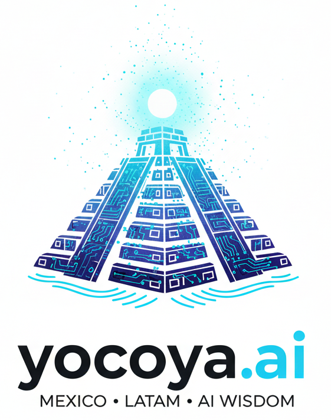
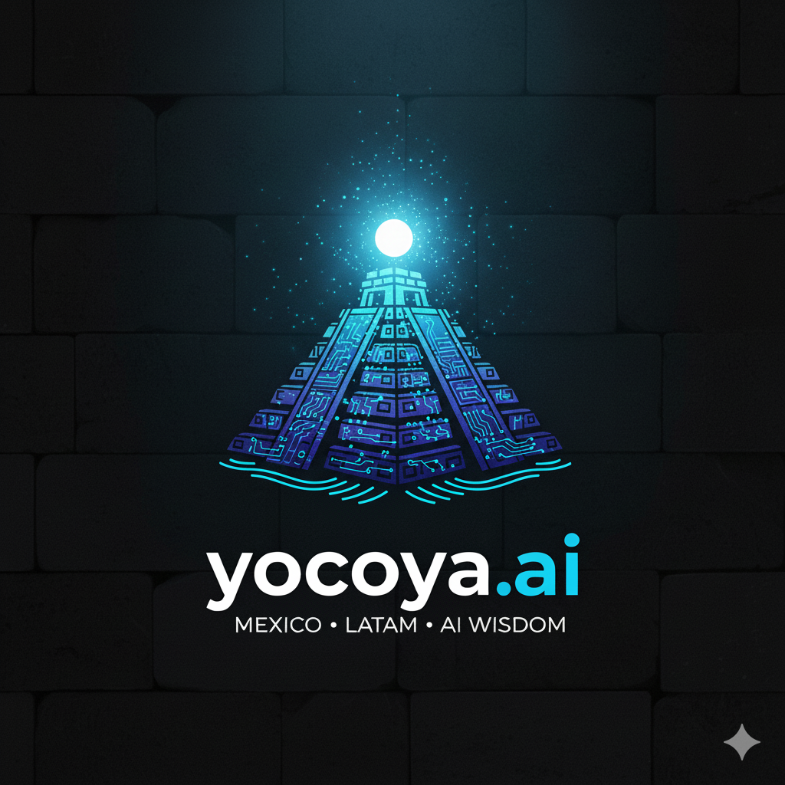

# Yocoya.ai — Media Kit

## About Yocoya

**Yocoya.ai** is the leading Spanish-language AI platform for Mexico and Latin America. We curate AI tools, news, educational resources, and communities — adapted for the realities of the LATAM market, not just translated from English.

Founded by **Baalam LLC**, Yocoya was built by Mexican creators and strategists who saw that 90% of AI content was in English and disconnected from the LATAM economy and culture. We changed that.

> *"No solo traducimos tecnologia; la adaptamos a tu realidad."*
> — We don't just translate technology; we adapt it to your reality.

---

## What We Do

| Section | Description |
|---------|-------------|
| **Herramientas** (Tools) | Curated directory of 500+ AI tools with pricing, use cases, and honest reviews |
| **Noticias** (News) | Daily AI news from 50+ specialized sources, filtered for LATAM relevance |
| **Recursos** (Resources) | APIs, courses, certifications, and communities for learning AI |
| **Boletin FrecuenciA** | Weekly newsletter delivering curated AI insights to subscribers |

---

## Brand Assets

### Logo

| Variant | Preview |
|---------|---------|
| White (dark bg) |  |
| Dark (light bg) |  |
| Icon only |  |

Download all logo files from the [`/logos`](./logos/) directory.

### Usage Guidelines

- Maintain clear space around the logo (minimum 1x the height of the "Y" icon)
- Do not stretch, rotate, or alter the logo colors
- On dark backgrounds, use the white variant; on light backgrounds, use the dark variant

### Brand Colors

| Color | Hex | Swatch | Usage |
|-------|-----|--------|-------|
| Amber (Primary) | `#F59E0B` |  | Primary accent, CTAs, affiliate buttons |
| Amber Light | `#FBBF24` |  | Hover states, highlights |
| Amber Dark | `#D97706` |  | Gradient endpoints, pressed states |
| Violet (Secondary) | `#8B5CF6` |  | AI/tech indicator, secondary accent |
| Zinc-950 (Base) | `#09090B` |  | Page background (dark mode) |
| Zinc-900 (Surface) | `#18181B` |  | Cards, sections |
| Zinc-50 (Text) | `#FAFAFA` |  | Primary text |
| Zinc-400 | `#A1A1AA` |  | Secondary text, descriptions |

**Design approach**: Dark-mode-first ("Linear meets Shopify Mexico"). 60% dark background, 30% surface, 10% amber accent.

### Typography

- **Font**: Inter (variable, 400–700)
- **Headlines**: Inter Bold, tight letter-spacing (-0.02em to -0.03em)
- **Body**: Inter Regular, 16px, line-height 1.6
- **Overline labels**: Inter SemiBold, 11px, uppercase, amber color

---

## Audience

| Metric | Detail |
|--------|--------|
| **Primary market** | Mexico and Latin America |
| **Languages** | Spanish (primary), English (secondary) |
| **Core audience** | Solopreneurs, creators, freelancers, small business owners, developers |
| **Focus** | AI tools, automation, and practical applications for business |

### Who Reads Yocoya

- Solopreneurs and side-hustlers looking to multiply their time
- Creators and freelancers producing content at scale
- Sales teams and businesses automating repetitive tasks
- Developers and builders integrating AI into real products
- Students and everyday people exploring what AI can do for them

---

## Key Facts

- **Website**: [yocoya.ai](https://yocoya.ai)
- **Newsletter**: [FrecuenciA](https://yocoya.ai/boletin)
- **Founded**: 2025
- **Parent company**: Baalam LLC
- **HQ**: Mexico City (CDMX)
- **Content approach**: Spanish-first, LATAM-adapted, ad-free

---

## Affiliate Disclosure

Yocoya is ad-free. Some links on our site are affiliate links — we may earn a small commission if you make a purchase. This allows us to keep the platform free of ads and focused on what matters: trusted tech resources and knowledge.

---

## Contact

For partnerships, press inquiries, or affiliate collaborations:

- **Email**: hello@yocoya.ai
- **Website**: [yocoya.ai/sobre](https://yocoya.ai/sobre)

---

*Last updated: February 2026*